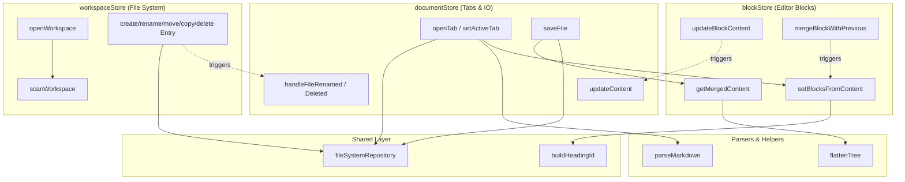

# Devoras Design - Functions Relationship Map

이 문서는 핵심 비즈니스 로직(Zustand 스토어)과 주요 유틸리티 함수들 간의 상호작용 및 데이터 흐름을 나타냅니다.

## 🔄 핵심 데이터 플로우 다이어그램

## 🔑 주요 함수 및 액션 관계 상세

### 1. 파일 열기 파이프라인 (Open File)
`FileExplorer`에서 파일 클릭 → `documentStore.openTab(file)` 호출.
1. `fileSystemRepository.readFile`를 통해 디스크에서 마크다운 로드.
2. `fileSystemRepository.readSpatialMetadata`로 `spatial.json`의 마인드맵 좌표 로드.
3. `parser.ts`의 `parseMarkdown`을 호출해 마크다운을 분석하고 `MindNode[]` 배열 생성.
4. `blockStore.setBlocksFromContent`를 호출하여 평문 텍스트를 `EditorBlock` 트리 구조로 슬라이스.
5. 활성 탭 및 `rawContent` 상태 업데이트.

### 2. 에디터 텍스트 입력 파이프라인 (Text Input)
`CodeMirrorBlock`에서 사용자가 텍스트 입력 → `BlockEditor.handleBlockUpdate` 호출.
1. `blockStore.updateBlockContent` 호출해 해당 블록 상태 갱신.
2. `blockStore.getMergedContent`로 전체 블록 평면화(`flattenTree`) 및 병합(문자열).
3. H1~H3 헤딩의 개수가 달라졌는지 정규식으로 검사.
   - **구조 변경 시**: `blockStore.setBlocksFromContent`를 호출해 트리를 재구성하고 커서 위치 재계산.
   - **단순 텍스트 시**: 150ms 디바운스 대기.
4. 최종적으로 `documentStore.updateContent`를 호출해 `rawContent` 동기화 및 `isDirty` 마킹.

### 3. 파일 저장 파이프라인 (Save File)
사용자가 `Cmd+S` 누름 → `documentStore.saveFile` 호출.
1. 현재 활성 탭의 종류(`markdown` / `erd`) 판별.
2. 마크다운의 경우 `blockStore.getMergedContent()`로 최신 텍스트 획득.
3. `fileSystemRepository.writeFile`로 텍스트 디스크 저장.
4. `fileSystemRepository.writeSpatialMetadata`로 마인드맵 좌표(`spatialData`) 디스크 덮어쓰기.
5. 현재 탭의 `isDirty` 플래그 해제.

### 4. 에디터 장식자 및 IME 처리 플로우 (Decorators & IME)
에디터 구문 강조 및 IME 조합 간섭 방지.
1. **DOM Event**: WebKit에서 `compositionstart` 발생 → `useImeInputManager`가 래치를 걸어 Zustand 동기화 지연.
2. **State Effect**: CodeMirror ViewPlugin이 `setImeEffect`를 Dispatch.
3. **Orchestrator**: `imeStateField`가 활성화된 동안 구문 장식자(Decorators)의 리빌드 스킵.
4. **Decorators**: 상태가 안정화되면 `BoldItalicDecorator`, `CodeBlockDecorator`, `ImageDecorator` 등이 커서 위치를 확인(`state.selection.main.head`)한 후 마크업 기호를 시각적 위젯으로 변환.
