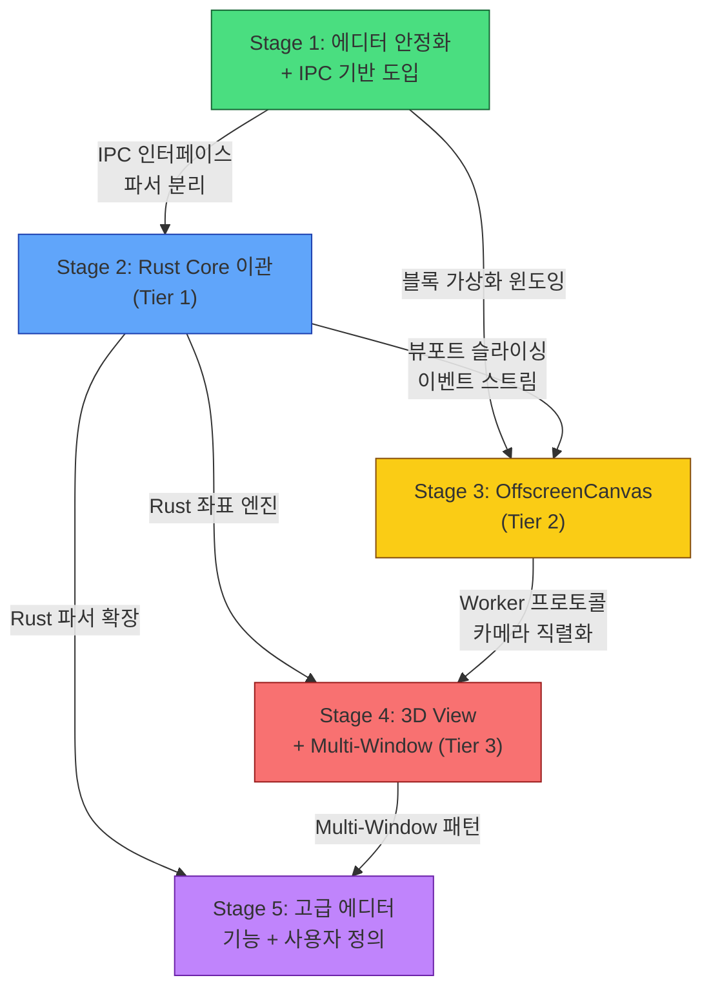

# Devoras Design - Architecture Stages

## 📌 이 문서의 목적
`function_roadmap.md`가 **"무엇을(What)"** 만들 것인지를 정의한다면, 이 문서는 **"어떤 순서와 방법으로(How)"** 만들되, **각 스테이지에서 다음 스테이지와 최종 스테이지를 위해 반드시 고려해야 할 아키텍처적 요소**를 명시합니다.

> 🎯 **목표:** 스테이지 간 리팩터링 비용을 최소화하고, 이전 스테이지의 산출물이 다음 스테이지의 토대가 되도록 최적화된 개발 경로를 설계합니다.

---

## 🏗️ 전제: 3계층 하이브리드 아키텍처

모든 스테이지는 아래 3계층 구조를 전제로 설계됩니다.

```
┌─────────────────────────────────────────────────┐
│           Tier 1: Rust Core (Tauri Backend)      │
│   AST Parser │ Graph Solver │ 3D Layout Engine   │
│              IPC (경량 JSON / MessagePack)        │
└──────────┬──────────────────────────┬────────────┘
           │                          │
┌──────────▼──────────────┐  ┌────────▼─────────────┐
│  Tier 2: Main Window    │  │ Tier 3: Lazy Window   │
│  Editor / MindMap / ERD │  │ 3D Architecture View  │
│  (OffscreenCanvas +     │  │ (별도 Tauri Window,   │
│   RAF Pause/Resume)     │  │  Hide/Show 전환)      │
└─────────────────────────┘  └───────────────────────┘
```

---

## Stage 1: 에디터 안정화 및 Rust IPC 기반 도입
> **대응 Phase:** function_roadmap Phase 4 + Phase 5 (성능 최적화 + 기술 부채 상환)

### 구현 목표
- **[x]** Critical Bug 3건 수정 (탭 데이터 유실, 중첩 블록 포맷, H1 Merge 정규식)
- **[x]** `documentStore`를 탭별 로컬 캐시 구조로 리팩터링
- **[x]** `BlockEditor` O(N) 병목 최적화
- **[x]** `Cmd+C` 키보드 이벤트 스코프 수정
- **[x]** Tauri Rust 명령(Command) 기초 인터페이스 정의 (`invoke` 패턴 표준화)
- **[ ]** **편집 표면 상시화 (Option B)** — 블록별 CodeMirror 인스턴스를 상시 마운트하여 "블록 활성화" 개념을 제거
- **[ ]** **Write Mode 타이포그래피 정상화** — `.cm-line *` 리셋 축소 + 헤딩 크기의 라인 레벨 선언

> 📌 **상세 실행 계획: [`DEBUG_PLAN.md`](DEBUG_PLAN.md)** (BUG-20260827-13)

#### 편집 표면 상시화가 Stage 1 에 들어온 배경

기존 설계는 **포커스된 블록만** CodeMirror 인스턴스이고 나머지는 `marked` 로 렌더된 HTML 이었다. 이 구조는 **캐럿 위치(문서의 속성)** 와 **렌더링 모드(DOM 의 속성)** 를 `activeBlockId` 로 결박하므로, **캐럿을 움직이는 행위가 곧 레이아웃 이벤트**가 된다.

그 결과가 BUG-20260827-13(블록 클릭 시 뷰포트 점프)이며, `v0.8.10` 에서 시도한 **스크롤 보정(FLIP 앵커)은 실패했다** — 보정은 열린 집합의 비동기 높이 변화(이미지·KaTeX·웹폰트)를 뒤쫓을 수만 있고 예방할 수 없다.

**결정(2026-08-27)**: 보정을 폐기하고 **모든 블록을 상시 편집 가능한 CodeMirror 인스턴스로 유지**한다. 클릭은 CM 네이티브 `mousedown` 이 처리하고, `activeBlockId` 는 렌더링 트리거가 아니라 **캐럿 위치에서 파생되는 값**이 된다.

| 항목 | 결정 |
|------|------|
| **Option A(문서 전체 단일 CM) 를 택하지 않은 이유** | H2/H3 를 중첩 라운드 카드로 렌더하는 현재 시각 디자인을 평면 라인 목록으로는 표현할 수 없다 |
| **블록 트리 모델의 존치** | `blockStore` 는 **문서 모델**로 유지한다(MindView·ERD·headingId·ReadView 재정렬이 의존). 폐기하는 것은 블록 트리를 **DOM 분할 방식**으로 쓰는 부분뿐이다 |
| **타이포그래피가 함께 들어온 이유** | Write Mode 에서 `marked` 렌더러가 사라지면 `.cm-h1` 무력화가 "포커스한 블록만 작아지는" 국소 결함에서 **문서 전체의 시각 결함**으로 승격된다. 선택 항목이 아니라 구성 요소다 |
| **연기 결정의 철회** | 종전에 "Stage 3/4 스레드 분리 이후"로 미뤘던 후보 C(헤딩 크기 반영)는 **Stage 1 로 편입**한다. 단, 인라인(`Decoration.mark`)이 아니라 **라인 레벨(`Decoration.line`)** 에 선언하여 0.6.1 캐럿 회귀 위험을 구조적으로 낮춘다 |

### 🔮 다음 스테이지(Stage 2)를 위한 고려사항
| 항목 | 설명 |
|------|------|
| **IPC 인터페이스 설계** | `documentStore`를 탭별로 분리할 때, 향후 Rust로 상태를 이관할 것을 고려하여 **store의 데이터 조회/변경 인터페이스를 `invoke` 호출과 1:1 매핑 가능한 형태**로 설계합니다. 예: `getBlockTree(tabId)`, `updateBlock(tabId, blockId, content)`. |
| **파서 모듈 분리** | `parser.ts`의 마크다운 파싱 로직을 순수 함수(Pure Function)로 격리합니다. 이후 Rust로 그대로 포팅(Rewrite)할 수 있도록 외부 의존성(React 상태, DOM 등)을 완전히 제거합니다. |
| **레이아웃 로직 분리** | `parser.ts`에 섞인 MindMap 좌표 계산 로직을 `MindView` 위젯 레이어로 이동합니다. Stage 2에서 이 연산을 Rust로 넘기기 위한 선행 조건입니다. |
| **EditorView 레지스트리** | 편집 표면 상시화로 인스턴스가 1개에서 N개가 됩니다. `activeEditorView.ts` 의 단일 싱글턴을 **`(paneId, blockId) → EditorView` 레지스트리**로 교체하고 "캐럿 보유 블록"을 별도 추적해야 합니다. `implementation_plan.md` §4A.6 과 **동일 지점이므로 함께 설계**할 것. |
| **블록 단위 IPC 의 자연스러운 정렬** | 인스턴스가 블록과 1:1 이 되면 `updateBlock(tabId, blockId, content)` 형태의 IPC 경계가 **DOM 경계와 일치**합니다. Stage 2 의 Thin Client 전환에 유리한 부수 효과입니다. |

### ⭐ 최종 스테이지(Stage 5)를 위한 고려사항
| 항목 | 설명 |
|------|------|
| **Tauri Command 네이밍 컨벤션** | Rust 명령 이름을 `devoras_{domain}_{action}` 형식으로 통일합니다 (예: `devoras_document_get_blocks`, `devoras_erd_solve_layout`). 도메인이 늘어나도 충돌 없는 네임스페이스를 확보합니다. |
| **직렬화 포맷 결정** | IPC 데이터의 직렬화 포맷을 JSON vs MessagePack 중 결정합니다. Stage 5에서 대량 노드 전송 시 MessagePack이 10배 이상 빠를 수 있으므로, 초기부터 serde 기반 추상화 레이어를 두는 것이 좋습니다. |

---

## Stage 2: Rust Core 이관 (Tier 1 구축)
> **대응 Phase:** function_roadmap Phase 4 심화

### 구현 목표
- [ ] 마크다운 AST 파서를 Rust로 재구현 (pulldown-cmark 또는 커스텀 파서)
- [ ] MindMap 레이아웃 연산(그래프 좌표 계산)을 Rust로 이관
- [ ] ERD 관계 해석(Relation Solving) 로직을 Rust로 이관
- [ ] 프론트엔드 Store를 "Thin Client" 패턴으로 전환: Rust에서 데이터를 받아 렌더링만 수행
- [ ] 파일 검색 인덱싱을 Rust로 구현 (향후 전체 텍스트 검색 대비)

### 🔮 다음 스테이지(Stage 3)를 위한 고려사항
| 항목 | 설명 |
|------|------|
| **뷰포트 기반 데이터 슬라이싱** | Rust에서 "전체 트리"가 아니라 **"현재 뷰포트에 보이는 노드만"** 반환하는 API를 설계합니다. Stage 3에서 OffscreenCanvas로 전환할 때, Worker가 필요한 최소 데이터만 받을 수 있는 기반이 됩니다. |
| **이벤트 스트림 설계** | Rust → 프론트엔드 방향의 **Push 이벤트**(Tauri `emit`)를 설계합니다. 파일 변경 감지, 백그라운드 인덱싱 완료 알림 등에 사용되며, Stage 4의 Multi-Window 간 상태 동기화의 토대가 됩니다. |

### ⭐ 최종 스테이지(Stage 5)를 위한 고려사항
| 항목 | 설명 |
|------|------|
| **플러그인 아키텍처 확장성** | Rust 명령 인터페이스를 향후 사용자 정의 플러그인(커스텀 파서, 커스텀 뷰)이 호출할 수 있도록 trait 기반 추상화로 설계합니다. |
| **WASM 폴백 옵션** | Rust 파서를 `wasm-pack`으로 WebAssembly로도 빌드할 수 있도록 `#[cfg(target_arch = "wasm32")]` 분기를 고려합니다. 웹 배포 옵션 확보. |

---

## Stage 3: OffscreenCanvas 전환 (Tier 2 구축)
> **대응 Phase:** function_roadmap Phase 4 완료 + Phase 6 일부 (마인드맵 미니맵, 자유형 노드)

### 구현 목표
- [ ] MindMap 캔버스를 OffscreenCanvas + Worker로 전환
- [ ] ERD 캔버스를 OffscreenCanvas + Worker로 전환
- [ ] 비활성 탭의 렌더링 루프(RAF) 일시정지/재개 메커니즘 구현
- [ ] 마인드맵 미니맵 및 자유형 노드 추가
- [ ] 이미지 상세 뷰어 (사이드 탭 줌인/줌아웃)

> ⚠️ **선행 관계 변경 (2026-08-27)** — Stage 1 의 편집 표면 상시화로 CodeMirror 인스턴스가 블록 수만큼 생기므로, `advanced_rendering_optimization.md` §3.4 의 **DOM 가상화가 Stage 3 가 아니라 Stage 1 에서 먼저 필요**해졌다. Stage 3 착수 시점에는 블록 에디터 가상화가 이미 존재한다고 전제할 것. 캔버스 뷰포트 컬링과 **동일한 윈도잉 개념을 공유**하도록 설계하면 중복 구현을 피할 수 있다.

### 🔮 다음 스테이지(Stage 4)를 위한 고려사항
| 항목 | 설명 |
|------|------|
| **Worker 통신 프로토콜 표준화** | Main ↔ Worker 간 메시지 형식을 `{ type: string, payload: T }` 패턴으로 통일합니다. Stage 4에서 Multi-Window IPC와 동일한 프로토콜을 공유할 수 있도록 합니다. |
| **카메라/뷰포트 상태 직렬화** | OffscreenCanvas의 카메라 위치, 줌 레벨을 직렬화 가능한 Plain Object로 관리합니다. Stage 4에서 별도 창으로 분리할 때 상태 이전(Migration)이 즉시 가능하도록 합니다. |

### ⭐ 최종 스테이지(Stage 5)를 위한 고려사항
| 항목 | 설명 |
|------|------|
| **렌더러 추상화** | `CanvasRenderer` 인터페이스를 정의하여, OffscreenCanvas 렌더러와 향후 WebGPU 렌더러를 교체 가능하게 합니다. |

---

## Stage 4: 3D 뷰 및 Multi-Window (Tier 3 구축)
> **대응 Phase:** function_roadmap Phase 6 (3D Freeform, 유즈케이스 시각화)

### 구현 목표
- [ ] React Three Fiber + Drei 기반 3D 아키텍처 뷰 구현
- [ ] 유즈케이스 시각화: 레이어 간 노드/연결선 순차 하이라이팅
- [ ] Tauri Multi-Window: 3D 뷰를 별도 창으로 Lazy 생성 & Hide/Show 전환
- [ ] 메인 창 ↔ 3D 창 간 IPC 상태 동기화 (Rust 이벤트 브릿지)
- [ ] 3D 좌표 레이아웃 연산을 Rust Core에서 수행하고 프론트엔드는 렌더링만 담당

### 🔮 다음 스테이지(Stage 5)를 위한 고려사항
| 항목 | 설명 |
|------|------|
| **Window Lifecycle 관리** | 워크스페이스 닫힘, 앱 종료 시 모든 자식 창이 안전하게 정리되는 Lifecycle Manager를 구현합니다. |
| **Cross-Window 단축키 충돌 방지** | 3D 창이 포커스를 가졌을 때 메인 창의 글로벌 단축키(`Cmd+S` 등)와 충돌하지 않도록 Window-scoped 키맵을 설계합니다. |

### ⭐ 최종 스테이지(Stage 5)를 위한 고려사항
| 항목 | 설명 |
|------|------|
| **Multi-Window 패턴 재사용** | 3D 뷰에서 검증된 Multi-Window 패턴을 향후 추가될 수 있는 다른 무거운 뷰(스케줄러, 화이트보드 등)에도 즉시 적용할 수 있도록 범용적으로 설계합니다. |

---

## Stage 5: 에디터 고급 기능 및 사용자 정의
> **대응 Phase:** function_roadmap Phase 6 나머지

### 구현 목표
- [ ] 명령어 시스템 (`\:` Slash Command 자동완성 팝업)
- [ ] 다단 레이아웃 (Multi-column) 병렬 블록 파싱 (`|| parallel-left`)
- [ ] 확장 마크다운 이미지 문법 (``)
- [ ] 사용자 설정 파일 (`.devoras/settings.json`) 연동
- [ ] 단일 블록 포커스 에디팅 (Zen Mode)

- [ ] 인라인 스마트 커스텀 심볼 (사용자 정의 심볼 위젯 + 호버 툴팁 + 상태 토글)
- [ ] 워크스페이스 전역 쿼리 시스템 (PKM 메타데이터 Aggregation — 커스텀 심볼의 전제조건)

### 🔮 이 스테이지의 고려사항 (최종)
| 항목 | 설명 |
|------|------|
| **Slash Command 확장성** | `\:` 명령어 시스템은 단순히 하드코딩된 명령 목록이 아니라, **플러그인이 새 명령을 등록할 수 있는 레지스트리 패턴**으로 설계합니다. |
| **병렬 블록 파싱의 Rust 연동** | `|| parallel-left` 같은 확장 문법의 파싱은 Stage 2에서 구축한 Rust AST 파서에서 처리하고, 프론트엔드는 렌더링만 담당합니다. |
| **설정 파일의 스키마 버저닝** | `.devoras/settings.json`에 `version` 필드를 포함하여 향후 설정 스키마가 변경되었을 때 마이그레이션이 가능하도록 합니다. |
| **커스텀 심볼 파싱 격리** | `::symbol::` 등의 구문이 코드 블록(``` , `` ) 내부에서 오작동하지 않도록 CodeBlockDecorator와 동일한 코드 펜스 격리 로직을 공유합니다. Rust 파서에서 코드 펜스 상태를 추적한 뒤 안전한 영역에서만 심볼을 파싱합니다. |
| **심볼 정의의 저장소** | 사용자 정의 심볼 목록을 `.devoras/symbols.json`에 저장하고, `settings.json`과 동일한 스키마 버저닝 전략을 적용합니다. |

---

## 📊 스테이지 간 의존성 맵



---

## ⚠️ 공통 주의사항 (모든 스테이지 적용)

1. **점진적 이관 원칙:** Rust로의 이관은 "Big Bang"이 아닌, 하나의 도메인(파서, 레이아웃, 검색)씩 점진적으로 수행합니다. 각 이관이 끝날 때마다 기존 JS 코드를 삭제하고 빌드가 통과하는지 검증합니다.
2. **프론트엔드 Store 최소화:** 모든 스테이지에서 Zustand Store에 저장하는 데이터는 **"현재 화면에 보이는 것"에 필요한 최소한의 데이터**로 제한합니다. 원본 데이터는 항상 Rust(또는 디스크)가 소유합니다.
3. **테스트 가능성:** 순수 함수(Pure Function)로 분리된 로직은 반드시 단위 테스트를 작성합니다. Rust 코드는 `#[cfg(test)]` 모듈, TypeScript는 Vitest를 사용합니다.
